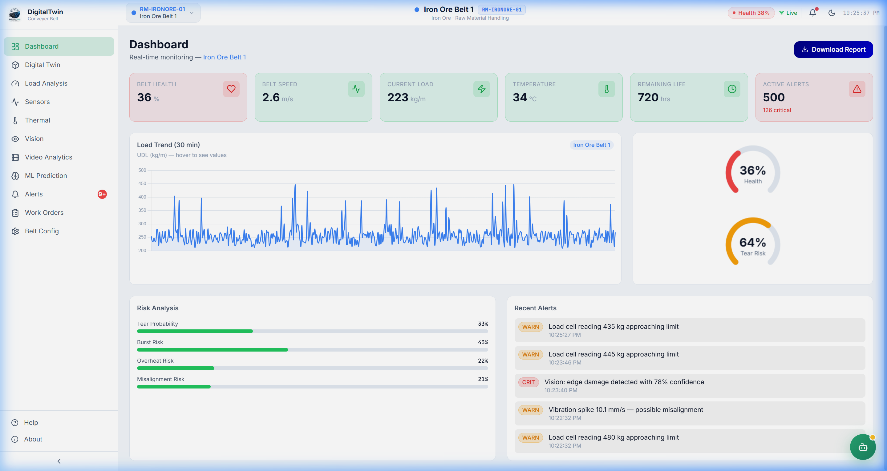
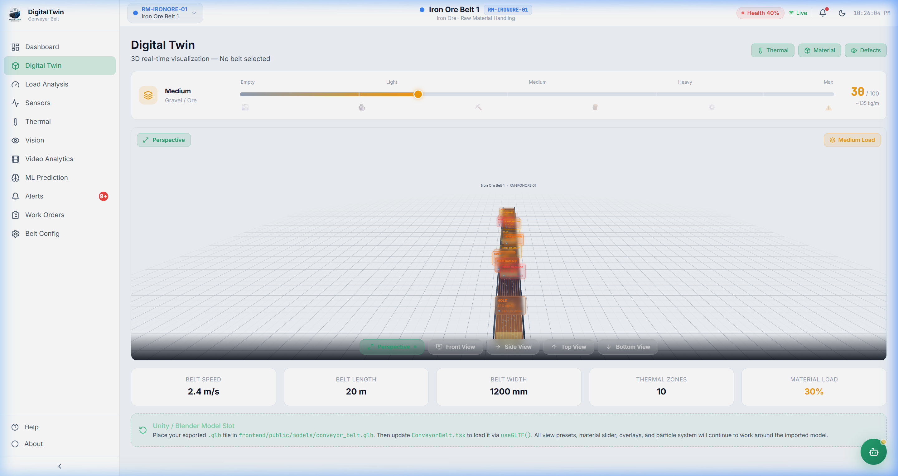
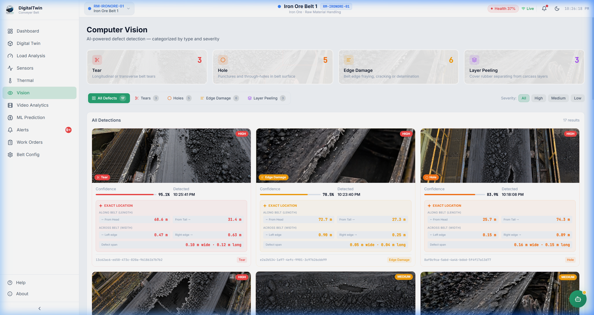
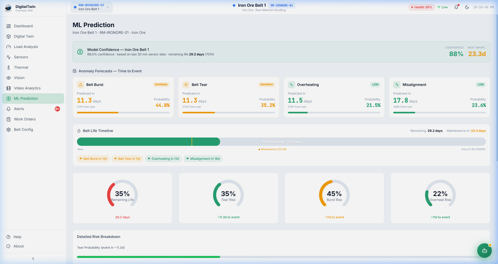

# DigitalTwin Conveyor Belt

> Real-time predictive monitoring, AI-powered defect detection, PLC/HMI control, and maintenance management for industrial conveyor belt systems.

    

---

## What is DigitalTwin Conveyor Belt?

A full-stack **Industrial IoT Digital Twin** platform for conveyor belt monitoring in steel plants, coal handling, and mining operations. It combines:

- **Live sensor telemetry** — load, temperature, vibration, speed, UDL streamed every 2 seconds
- **Physics-informed ML predictions** — remaining belt life, tear / burst / overheat / misalignment risk
- **Computer vision defect detection** — AI-classified holes, tears, edge damage, layer peeling with real images
- **3D Digital Twin** — interactive Three.js belt model with thermal overlays, defect markers, and PLC-linked animation
- **PLC / HMI Control** — real belt start/stop/e-stop, speed control, safety interlocks, editable auto-response rules
- **10-minute sustained-condition gate** — belt only auto-stops after a critical condition persists for 10 minutes
- **Restart gate** — after auto-stop, belt can only restart after a work order ticket is resolved OR defects are cleared
- **Unified notifications** — PLC events + system alerts in one bell, toast popups broadcast to all workers
- **Fleet Overview** — all 44 belts on one page with defect counts, severity breakdown, and sparklines
- **Work Order Management** — assign tasks to engineers via WhatsApp, Email, SMS, Jira, ServiceNow, IBM Maximo
- **AI Chat Assistant** — GPT-4o-mini (or rule-based fallback) answering maintenance questions in context

---

## What's New in v2.0

| Feature | Description |
|---------|-------------|
| **Fleet Overview** | New landing page — all 44 belts with defect counts, severity pills, 12h sparklines, one-click to belt dashboard |
| **PLC / HMI** | Full control panel: start/stop/e-stop, speed slider, safety interlocks, motor status, command audit log |
| **10-min Sustained Gate** | Critical auto-rules only fire after condition holds for 10 minutes — prevents transient spike stops |
| **Vision 2-in-10-min Rule** | Belt stops only after 2+ high-severity vision detections within 10 minutes |
| **Restart Gate** | After auto-stop, restart blocked until work order ticket resolved OR defects cleared |
| **Editable Auto-Rules** | Change thresholds, cooldowns, and actions from the PLC page UI |
| **Chart Freeze on Stop** | All scrollable charts freeze with STOPPED overlay when belt is halted |
| **E-Stop from Vision** | E-Stop and Assign buttons on each detection card |
| **Unified Bell** | Single notification center combining PLC events + system alerts, no duplicate toasts on refresh |
| **Severity Distribution** | Vision defects: 70% low, 25% medium, 5% high — realistic for demo |

---

## Visual Overview

### 🏠 Fleet Overview
All 44 belts at a glance with defect counts and sparklines.

### 🖥️ Belt Dashboard
Per-belt live KPIs and scrollable load trend chart.


### 🧊 3D Digital Twin
Interactive Three.js visualization — freezes when PLC stops the belt.


### 🔧 PLC / HMI Control
Real belt control with auto-rules, interlocks, and restart gate.

### 👁️ Computer Vision
AI defect detection with E-Stop and Assign buttons per card.


### 🤖 ML Prediction
Physics-informed risk forecasts and anomaly timeline.


---

## Project Structure

```
DigitalTwin/
├── frontend/          # React 18 + Vite + TypeScript + Tailwind CSS
│   └── src/
│       ├── pages/     # All page components (Fleet Overview, Belt Dashboard, PLC, etc.)
│       ├── components/# Reusable UI (ScrollableChart, PLCNotificationToast, etc.)
│       ├── api/       # TanStack Query hooks (usePLCState, useSensorHistory, etc.)
│       ├── lib/       # useTimeSeriesBuffer, chartConfig, exportReport
│       └── store/     # Zustand store (plcBeltRunning, selectedBelt, theme)
├── backend/           # Node.js + Express + TypeScript (REST API + WebSocket)
│   └── src/
│       ├── routes/    # dashboard, belts, sensors, load, thermal, vision, alerts, plc
│       ├── store/     # In-memory data store (sensor ring buffer, PLC state, auto-rules)
│       ├── simulator.ts # Sensor data generator + PLC auto-rule engine
│       └── types/     # Shared TypeScript types (PLCState, PLCAutoRule, PLCNotification, etc.)
├── ml-service/        # Python FastAPI (ML predictions + AI chat)
└── docs/              # API and architecture documentation
```

---

## Quick Start

### Prerequisites

| Tool | Version |
|------|---------|
| Node.js | 18+ |
| Python | 3.10+ |
| npm | 9+ |

### Step 1 — Install dependencies

```bash
# Backend
cd backend && npm install

# Frontend
cd frontend && npm install

# ML Service
cd ml-service && pip install -r requirements.txt
```

### Step 2 — Configure environment

**Backend** (`backend/.env`):
```env
PORT=8000
NODE_ENV=development
ML_SERVICE_URL=http://localhost:8001
CORS_ORIGIN=*
```

**ML Service** (`ml-service/.env`):
```env
ML_PORT=8001
BACKEND_URL=http://localhost:8000
OPENAI_API_KEY=sk-...   # Optional — enables GPT-4o-mini AI chat
```

### Step 3 — Start all services

```bash
# Terminal 1 — Backend
cd backend && npm run dev

# Terminal 2 — ML Service
cd ml-service && python main.py

# Terminal 3 — Frontend
cd frontend && npm run dev
```

Open **http://localhost:3000**

---

## Feature Guide

### Fleet Overview (`/`)

The landing page. Click the DigitalTwin logo in the sidebar to return here from any page.

- **6 KPI cards** — Total Belts, Active Defects, Critical/Medium/Low counts, System Alerts
- **Defect category breakdown** — Tear, Hole, Edge Damage, Layer Peeling with severity splits and fill bars
- **Live sensor snapshot** — 6 sensor readings with color-coded thresholds
- **Belt grid by area** — all 44 belts grouped by plant area with 12-hour sparklines
- **Click any belt card** → selects that belt and navigates to Belt Dashboard

---

### Belt Dashboard (`/dashboard`)

Per-belt deep stats for the selected belt.

- **6 KPI cards** — Belt Health %, Speed, Load, Temperature, Remaining Life, Active Alerts
- **Scrollable Load Trend chart** — Grafana-style, scroll left for history, zoom ±
- **Chart states**: LIVE (green pulse) when running, STOPPED (red overlay) when halted
- **Health & Tear Risk gauges** — circular gauge charts
- **Risk Analysis bars** — Tear, Burst, Overheat, Misalignment from ML model
- **Clear Defects button** — resets vision detections AND unlocks the PLC restart gate

---

### Digital Twin (`/digital-twin`)

3D belt visualization linked to PLC state.

- **Belt animation** — surface scrolls at live belt speed; freezes when PLC stops the belt
- **Material particles** — freeze in place when belt is stopped
- **Belt Stopped banner** — red banner with "Assign Worker" and "Restart Belt" buttons
- **E-STOP button** — overlaid on 3D canvas, two-step confirm
- **Belt running indicator** — top center shows BELT RUNNING / BELT STOPPED
- **5 camera presets** — Perspective, Front, Side, Top, Bottom
- **Overlays** — Thermal zones, Defect markers, Material flow (toggleable)

---

### PLC / HMI (`/plc`)

Real-time belt control panel.

**Belt Control:**
- START / STOP / EMERGENCY STOP (two-step confirm)
- Reset Fault button when in fault/e-stop state
- START is blocked when restart gate is active (shows "RESTART BLOCKED")

**Restart Gate (shown when belt was auto-stopped):**
- **Option 1** — Enter work order ticket reference → Confirm → gate cleared
- **Option 2** — Clear all defects → gate cleared
- Both options send a notification to all workers: "Restart Cleared"

**Speed Control:**
- Slider (0.5–6.0 m/s) + preset buttons (1.0, 1.5, 2.0, 2.5, 3.0, 4.0)
- Only active when belt is running

**Safety Interlocks:**
- Emergency Pull Cord, Zero Speed Switch, Safety Gate, Overload Relay
- Tripped interlocks with `preventStart: true` block the START button

**Auto-Response Rules (editable):**

| Rule | Condition | Action | Gate |
|------|-----------|--------|------|
| Sustained Overload | Load Cell > 480 kg for 10 min | E-Stop | Yes |
| Critical Impact | Impact Force > 40 kN for 10 min | E-Stop | Yes |
| Vision Critical | 2+ high detections in 10 min | E-Stop | Yes |
| High Load | UDL > 420 kg/m | Reduce speed to 1.5 m/s | No |
| High Temperature | Temp > 100°C for 10 min | Stop | Yes |
| Vibration Spike | Vibration > 12 mm/s | Alert only | No |

Click **Edit** on any rule to change threshold, cooldown, or reduce-speed target.

**10-minute sustained-condition logic:**
1. Condition first detected → warning notification: "Belt will stop in 10 min if unresolved"
2. Every 2 minutes while active → monitoring reminder with countdown
3. After 10 minutes → belt stops, restart gate activated

**Command Audit Log** — every command with operator, timestamp, value, reason, accepted/rejected.

---

### Notifications (Bell Icon — top bar)

Unified notification center combining PLC events and system alerts.

- **Badge** — total unread count (PLC + system)
- **Two tabs** — "PLC / Auto-Rules" and "System Alerts"
- **Toast popups** — bottom-right, auto-dismiss after 8 seconds with progress bar
- **No duplicate toasts on refresh** — seen IDs persisted to sessionStorage
- **Mark all read** — clears the badge

PLC notification types:
- `⚠️ CONDITION DETECTED` — first time condition is met (warning)
- `⏱️ MONITORING` — every 2 min while condition persists (warning)
- `🚨 AUTO E-STOP` — belt stopped after 10 min (critical)
- `✅ RESTART CLEARED` — gate cleared by ticket or defects (info)

---

### Computer Vision (`/vision`)

AI defect detection with action buttons.

- **E-STOP button** on high/medium severity cards — stops belt immediately, records reason
- **Assign button** on all cards — navigates to Work Orders
- **Exact Location** — distance from head, tail, left edge, right edge in metres
- **Severity distribution** — 70% low, 25% medium, 5% high (realistic)
- **Live Camera Views** — 4 feeds with CCTV overlays, fullscreen popup

---

### Video Analytics (`/video-analytics`)

Natural language search across 48h of detection history.

- Compact 5-per-row result cards with image, severity pills, defect tags, location line
- Click any card → video player modal auto-seeks to that timestamp
- Advanced Filters — date, hour range, defect type, severity, belt

---

### Sensors (`/sensors`)

Scrollable live charts for all 6 sensor channels.

- Charts freeze with STOPPED overlay when belt is halted
- Polling stops when belt is stopped (no fake data generated)
- Normalised overlay chart for cross-sensor comparison
- Latest Reading table with warn/crit thresholds

---

### Load Analysis (`/load`)

Physics-based load modeling.

- Side-by-side scrollable UDL Trend and Load Cell vs Impact Force charts
- Both charts freeze when belt is stopped
- Engineering Constraints table

---

### Work Orders (`/work-orders`)

Assign maintenance tasks. Resolving a ticket unlocks belt restart.

- Tag alerts, vision detections, or belt positions
- 6 notification channels: WhatsApp, Email, SMS, Jira, ServiceNow, IBM Maximo
- After sending: "Mark as Resolved → Unlock Belt Restart" button appears in sent log
- Clicking it calls `POST /api/plc/clear-gate/ticket` → belt can restart

---

## API Reference

### Backend REST API — port 8000

| Method | Endpoint | Description |
|--------|----------|-------------|
| GET | `/health` | Service health check |
| GET | `/api/dashboard/summary` | KPI summary |
| GET | `/api/belts` | List belt configurations |
| POST | `/api/belts` | Create belt config |
| PUT | `/api/belts/:id` | Update belt config |
| GET | `/api/sensors/live` | Latest sensor reading |
| GET | `/api/sensors/history?minutes=30` | Sensor history |
| GET | `/api/load/live` | Latest load analysis |
| GET | `/api/thermal/zones` | All thermal zones |
| GET | `/api/vision/detections` | Latest 20 vision detections |
| DELETE | `/api/vision/detections` | Clear all detections (demo) |
| GET | `/api/alerts` | All alerts |
| PATCH | `/api/alerts/:id/acknowledge` | Acknowledge alert |
| GET | `/api/plc/state` | Current PLC state |
| POST | `/api/plc/command` | Send PLC command (START/STOP/E_STOP/SET_SPEED/RESET_FAULT) |
| GET | `/api/plc/auto-rules` | List auto-response rules |
| PATCH | `/api/plc/auto-rules/:id` | Update rule (threshold, cooldown, enabled) |
| GET | `/api/plc/commands` | Command audit log |
| GET | `/api/plc/notifications` | PLC notifications |
| PATCH | `/api/plc/notifications/read-all` | Mark all notifications read |
| POST | `/api/plc/clear-gate/ticket` | Clear restart gate via ticket resolution |
| POST | `/api/plc/clear-gate/defects` | Clear restart gate via defect clearance |

### PLC Command Payload

```json
{
  "command": "START" | "STOP" | "E_STOP" | "SET_SPEED" | "RESET_FAULT",
  "value": 2.5,
  "operator": "Operator 1",
  "reason": "Manual start from HMI"
}
```

### Clear Gate — Ticket

```json
{ "ticketRef": "BELT-12345", "resolvedBy": "Rajesh Kumar" }
```

### WebSocket — port 8000, path `/ws`

```json
{
  "type": "live_update",
  "sensor": { "loadCell": 245, "temperature": 38.2, "vibration": 2.1, "beltSpeed": 2.5, "udl": 210, "impactForce": 8.5 },
  "alerts": [ { "id": "...", "severity": "warning", "message": "..." } ],
  "ts": "2026-04-28T10:00:00Z"
}
```

### ML Service REST API — port 8001

| Method | Endpoint | Description |
|--------|----------|-------------|
| GET | `/predict` | Auto-fetch sensors and predict |
| POST | `/predict` | Predict from provided payload |
| GET | `/health` | ML service health check |
| POST | `/chat` | AI chat with belt context |

---

## Architecture

```
┌──────────────────────────────────────────────────────────────┐
│                      Browser (React 18)                       │
│                                                               │
│  Fleet Overview  Belt Dashboard  Digital Twin  PLC/HMI        │
│  Sensors  Load  Thermal  Vision  Video  ML  Alerts  WO        │
│                                                               │
│  TanStack Query (polling + caching)  Zustand (plcBeltRunning) │
│  useTimeSeriesBuffer (sliding window, freeze on stop)         │
│  ScrollableChart (Grafana-style, STOPPED overlay)             │
│  PLCNotificationToast (sessionStorage dedup, toast stack)     │
└──────────────┬────────────────────────────┬──────────────────┘
               │ REST /api/*                │ REST /ml/*
               │ WebSocket /ws              │ (proxied by Vite)
               ▼                            ▼
┌──────────────────────────┐   ┌──────────────────────────────┐
│  Node.js / Express :8000 │   │  Python / FastAPI :8001       │
│                          │   │                               │
│  Sensor simulator        │◄──│  GET /predict                 │
│  PLC auto-rule engine    │   │   → fetches /api/sensors/live │
│  10-min sustained gate   │   │   → runs BeltPredictor        │
│  Restart gate logic      │   │  POST /chat                   │
│  In-memory data store    │   │   → LangChain + GPT-4o-mini   │
│  REST API routes         │   │   → rule-based fallback        │
│  WebSocket server        │   └──────────────────────────────┘
└──────────────────────────┘
```

**Data flow when belt is running:**
1. Simulator generates sensor readings every 2s → ring buffer (max 500)
2. Frontend polls `/api/sensors/live` every 2s, `/api/sensors/history` for charts
3. `useTimeSeriesBuffer` merges new points into session buffer (max 2000)
4. `ScrollableChart` renders buffer, auto-scrolls to latest
5. PLC auto-rule engine evaluates rules on every tick
6. If condition sustained 10 min → belt stops, restart gate activated

**Data flow when belt is stopped:**
1. Simulator skips sensor generation (no new readings)
2. Frontend polling stops (`refetchInterval: false`)
3. Buffer freezes at last reading
4. Charts show STOPPED overlay
5. Belt cannot restart until gate is cleared

---

## PLC Auto-Rule Engine

The simulator evaluates auto-rules on every 2-second tick:

```
For each enabled rule:
  1. Check cooldown (skip if within cooldown window)
  2. Evaluate condition (metric > threshold)
  3. Special: vision rule requires 2+ high detections in 10-min window
  4. If condition just became true:
     → Push "CONDITION DETECTED" warning notification
     → Start 10-minute timer
  5. If condition active < 10 min:
     → Push monitoring reminder every 2 min
  6. If condition active ≥ 10 min:
     → Execute action (E_STOP / STOP / REDUCE_SPEED / ALERT_ONLY)
     → Set restartGated = true (for stop actions)
     → Push critical notification to all workers
```

---

## Tech Stack

### Frontend
| Library | Purpose |
|---------|---------|
| React 18 + TypeScript 5 | UI framework |
| Vite 5 | Build tool |
| Tailwind CSS 3 | Styling |
| Framer Motion 11 | Animations |
| TanStack Query 5 | Server state, polling |
| Zustand 4 | Client state (plcBeltRunning, belt selection, theme) |
| React Router 6 | Routing |
| Three.js + React Three Fiber | 3D Digital Twin |
| Chart.js 4 | Scrollable time-series charts |
| Lucide React | Icons |
| Axios | HTTP client |

### Backend
| Library | Purpose |
|---------|---------|
| Express 4 | HTTP server |
| TypeScript 5 | Type safety |
| ws | WebSocket server |
| helmet + cors | Security |
| uuid | ID generation |

### ML Service
| Library | Purpose |
|---------|---------|
| FastAPI | Async HTTP framework |
| Pydantic 2 | Validation |
| scikit-learn | ML model |
| LangChain + langchain-openai | GPT-4o-mini chat |
| httpx | Async HTTP client |
| uvicorn | ASGI server |

---

## Developer Guide

### Adding a new PLC auto-rule

Edit `backend/src/store/inMemory.ts` — add to `plcAutoRules`:

```typescript
{
  id: uuid(),
  name: 'My Rule',
  condition: 'Metric > threshold for 10 min',
  action: 'Description of action',
  enabled: true,
  triggerCount: 0,
  metric: 'loadCell',      // loadCell | udl | temperature | vibration | impactForce | visionConfidence
  threshold: 400,
  operator: '>',
  triggerAction: 'E_STOP', // E_STOP | STOP | REDUCE_SPEED | ALERT_ONLY
  reduceSpeedTo: 1.5,      // only for REDUCE_SPEED
  cooldownSeconds: 600,
}
```

### Connecting real PLC hardware

Replace the in-memory `plcState` with OPC-UA / Modbus TCP reads:

```typescript
// OPC-UA example
import { OPCUAClient } from 'node-opcua';
const client = OPCUAClient.create({ endpointMustExist: false });
await client.connect('opc.tcp://plc-host:4840');
// Read belt state, write commands via OPC-UA nodes
```

### Replacing the simulator with real sensors

Edit `backend/src/simulator.ts` — replace `setInterval` with your data source:

```typescript
import mqtt from 'mqtt';
const client = mqtt.connect('mqtt://your-broker:1883');
client.subscribe('plant/belt/sensors');
client.on('message', (_topic, payload) => {
  const reading = JSON.parse(payload.toString()) as SensorReading;
  pushSensor(reading);
  runAutoRules(reading, 0);
});
```

---

## Environment Variables

### Backend (`backend/.env`)

| Variable | Default | Description |
|----------|---------|-------------|
| `PORT` | `8000` | HTTP server port |
| `NODE_ENV` | `development` | Environment mode |
| `ML_SERVICE_URL` | `http://localhost:8001` | ML service URL |
| `CORS_ORIGIN` | `*` | Allowed CORS origins |

### ML Service (`ml-service/.env`)

| Variable | Default | Description |
|----------|---------|-------------|
| `ML_PORT` | `8001` | FastAPI port |
| `BACKEND_URL` | `http://localhost:8000` | Backend URL |
| `OPENAI_API_KEY` | _(empty)_ | Enables GPT-4o-mini |

---

## Troubleshooting

**Charts are empty**
- Confirm backend is running and generating sensor data
- Check browser console for network errors
- If belt is stopped, charts show last readings before stop — this is correct behaviour

**Belt keeps auto-stopping immediately**
- Check PLC auto-rules thresholds on the PLC page — default thresholds are realistic (480 kg, 40 kN, 100°C)
- The 10-minute gate means the belt won't stop on a single spike — condition must persist

**Belt won't restart after auto-stop**
- The restart gate is active — go to PLC page to see the restart gate banner
- Option 1: Enter a work order ticket reference and click Confirm
- Option 2: Click "Clear Defects & Unlock" or use the "Clear Defects" button on the Dashboard

**Notifications re-appearing after refresh**
- This was fixed — seen IDs are stored in sessionStorage
- If still happening, clear sessionStorage: `sessionStorage.removeItem('plc-notif-seen')`

**ML predictions not updating**
- Confirm ML service is running on port 8001
- Frontend uses mock data when ML service is unreachable — this is by design

---

## License

MIT — free to use, modify, and distribute.

---

*Built for industrial conveyor belt monitoring in steel, coal, and mining operations.*
